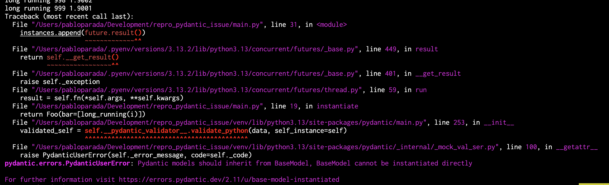

Reproducible for https://github.com/pydantic/pydantic/issues/11849

Tested using python 3.13.2 on Apple M1 Pro | 16GB

```
python -m venv venv
source venv/bin/activate
pip install pydantic==2.11.3
python main.py
```


